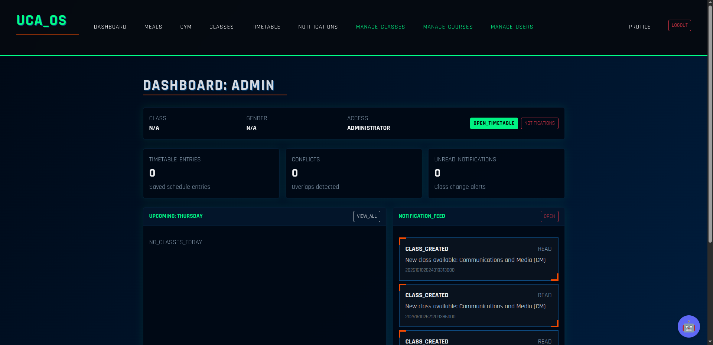
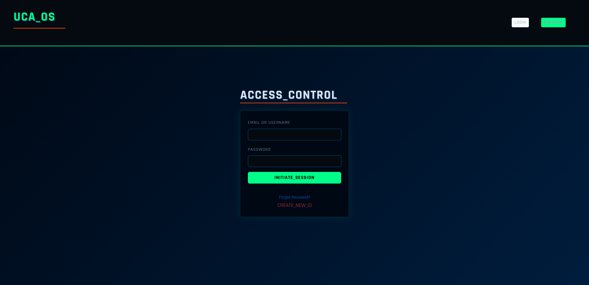
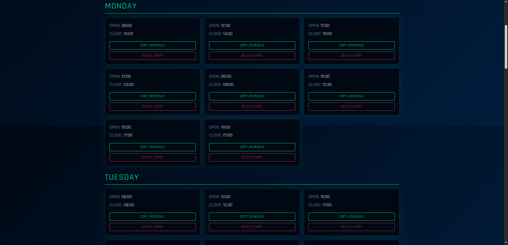

# UCA Schedule App

Full-stack university schedule app with:
- Authentication (JWT)
- Class schedules + personal timetable builder
- Conflict detection
- Export timetable to `.ics`
- In-app notifications (read/unread) + class change alerts

## Project structure

- `backend/` — Spring Boot (Java 17) REST API
- `frontend/` — React + Vite

## Prerequisites

- Java 17+
- Maven
- Node.js 18+ (recommended)
- MySQL running locally (default)

## Quick start (local dev)

### 1) Backend (Spring Boot)

The backend runs on port **8000**.

1. Configure DB (defaults are in `backend/src/main/resources/application.properties`):

- Database: `uca-schedule-db`
- Username: `${DB_USER:root}`
- Password: `${DB_PASSWORD:MySecurePassword123!}`

2. Run:

```bash
mvn spring-boot:run
```

The API base URL will be:

- `http://127.0.0.1:8000/api`

### 2) Frontend (React)

The frontend uses a fixed API URL:

- `http://127.0.0.1:8000/api`

Run:

```bash
npm install
npm run dev
```

Vite typically serves on:

- `http://localhost:5173`

> CORS is already configured for common Vite ports in `application.properties`.

## Key features

### Authentication

- Login/register flows
- Protected routes
- Tokens stored in `localStorage`

Endpoints:
- `POST /api/token/`
- `POST /api/token/refresh/` *(currently a stub: returns the same token payload)*
- `GET /api/me/`

### Class schedules

Endpoints:
- `GET /api/classes/`
- `POST /api/classes/` *(admin can create for multiple student classes)*
- `PUT /api/classes/{id}/` *(admin)*
- `DELETE /api/classes/{id}/` *(admin)*

### Personal timetable

Users can select existing schedule entries and save them as “My Timetable”.

Endpoints:
- `GET /api/timetable/` — returns `{ entries, conflicts }`
- `POST /api/timetable/` — save selected schedule IDs
- `GET /api/timetable/ics/` — download `.ics`

### Conflict detection

- Detects overlapping timetable entries per day.
- Conflicts are returned in `/api/timetable/` response.

### Notifications

- In-app notification center (read/unread)
- Unread badge in navbar
- Class change alerts:
  - When an admin updates a class schedule → students in that student class receive `CLASS_UPDATED`
  - When an admin deletes a class schedule → `CLASS_DELETED`

Endpoints:
- `GET /api/notifications/`
- `GET /api/notifications/unread-count/`
- `POST /api/notifications/{id}/read/`
- `POST /api/notifications/read-all/`

## UI pages

Common routes:
- `/dashboard`
- `/timetable`
- `/notifications`
- `/classes`
- `/meals`
- `/gym`
- `/profile`

## Screenshots

Add screenshots under `screenshots/` and reference them here.

Suggested files:
- `screenshots/dashboard.png`
- `screenshots/timetable.png`
- `screenshots/notifications.png`

Placeholders:

### Dashboard



### Login



### Timetable



## Database notes

- JPA is set to:

```properties
spring.jpa.hibernate.ddl-auto=update
```

So tables are created/updated automatically on startup.

## Troubleshooting

### Frontend cannot reach backend (CORS)

- Ensure backend is running on `:8000`.
- Ensure you are using a Vite origin listed in:

```properties
spring.web.cors.allowed-origins=...
```

### Login works but token refresh does not

- The frontend has auto-refresh logic, but the backend refresh endpoint is currently a placeholder.

### Navbar appears only after refresh

- Fixed by resetting navbar opacity/transform when auth state changes.

## Future roadmap

- Travel-time conflict detection
- Meal/Gym reminders
- Favorites
- Ratings/reviews
- Admin CSV import + audit logs
